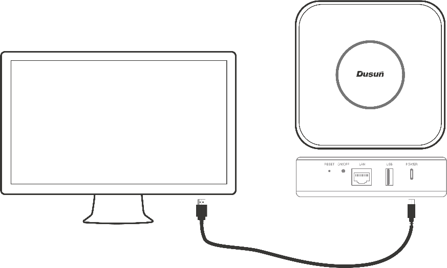
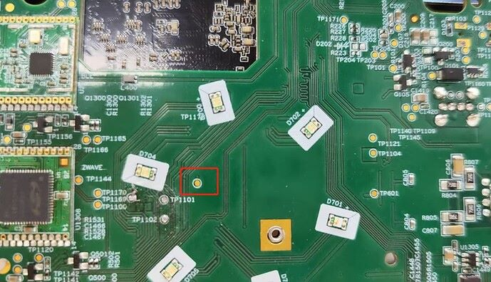

## Flash HomeAssistant OS into dsgw-210

### Supported boards:

- Dusun dsgw-210

### Read First:

1. This firmware uses mainline u-boot. If you want to flash it back to the original firmware, You NEED use **Option 1** below to re-flash it.
2. The serial changes from 115200n8 to 1500000n8, you’d better use a cp2104 usb2uart bridge (cp2102 won’t work).

### Download flash tools and firmware

1. Install rockchip flash tools as in dusun wiki [dsgw-210](https://wiki.dusuniot.com/iot_gateway_with_applications/dsgw-210-rk3328-home-assistant-gateway/quick-start-guide). I prefer a recent version(which has a checkbox: "Write by Address", download [RKDevTool_Release_v3.31.zip](https://download.t-firefly.com/product/Board/RK3588/Tool/Window/RKDevTool_Release_v3.31.zip) and [DriverAssitant_v5.1.1.zip](https://download.t-firefly.com/product/Board/RK3588/Tool/Window/DriverAssitant_v5.1.1.zip) from [firefly](https://www.t-firefly.com/doc/download/183.html) site .
2. Download the loader (MiniLoaderAll.bin or rk3328_loader_v1.14.249.bin) and firmware (haos_dsgw-210-13.1.img.xz), unzip the firmware.

### Flash the box

1. Launch RKDevTool, and prepare to connect the PC to the dsgw-210 (hereinafter called the "box") using a type-c cable.
  
2. Make the box into MASKROM mode:
  
3. Option 1: Provide 3.3V voltage (eg. 3.3v from usb2uart bridge ) to the point and then connect to the box using the type-c cable, and it will show in MaskRom mode.
  
4. Option 2: Connect to the box using the type-c cable, it will show as an "ADB device", click "Advanced Function" tab, and then click "Go Maskrom". 
  
5. Click the "Download Image" tab, and input as follows, check the "Write by Address" checkbox and then click "Run" button. The list box on the right shows the flashing progress. When flashed to 100%, the box will restart, and the green leds turns on about 3 seconds later, wait 1-2 minutes for the box to startup.
  
 
### Wait for HAOS to startup

1. Now lookup the ip address of the box (the box gets ip using dhcp, ping homeassistant -4 or just lookup it from the dhcp server).
2. Browse http://ip_of_the_box:4357 and then http://ip_of_the_box:8123.

## Hardware support

### Working hardware
    - Serial / Uart
    - Ethernet

### TODO
    - Wifi
    - Bluetooth

Feel free to contact me via email at dongbh # outlook.com.
