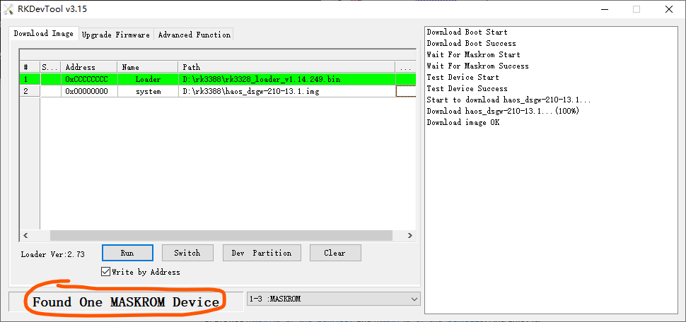
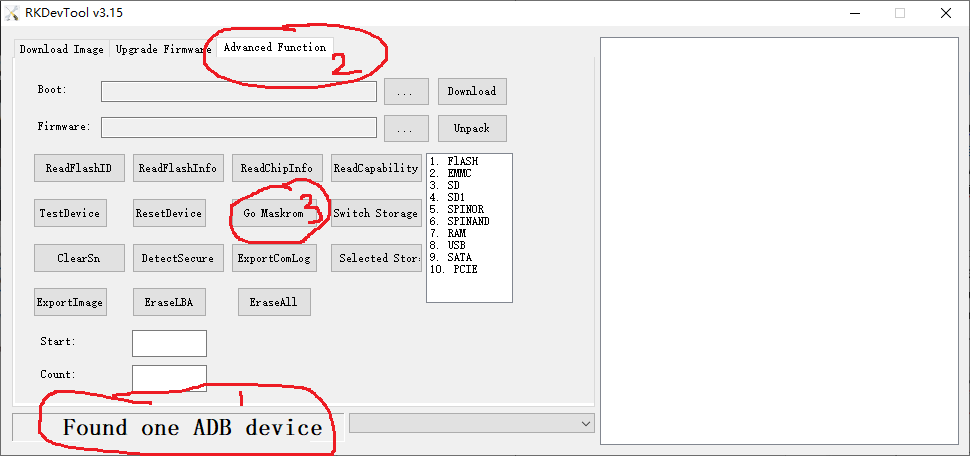

## Flash HomeAssistant OS into dsgw-210

### Supported boards:

---

DUSUN dsgw-210

### Read First:

---

1. This firmware use mainline u-boot. You must use Option 1  bellow to re-flash it to the original firmware.
2. The serial changes to 1500000n8, you’d better use a cp2104 usb2ttl (cp2102 won’t work).

### Download flash tools and firmware

---

1. Install rockchip flash toos as wiki [dsgw-210](https://wiki.dusuniot.com/iot_gateway_with_applications/dsgw-210-rk3328-home-assistant-gateway/quick-start-guide). I prefer a recent version(which has a checkbox: "Write by Address", download from [RKDevTool_Release_v3.31.zip](https://download.t-firefly.com/product/Board/RK3588/Tool/Window/RKDevTool_Release_v3.31.zip) with [DriverAssitant_v5.1.1.zip](https://download.t-firefly.com/product/Board/RK3588/Tool/Window/DriverAssitant_v5.1.1.zip). Both from firefly site [firefly](https://www.t-firefly.com/doc/download/183.html).
2. Download the loader ( MiniLoaderAll.bin or rk3328_loader_v1.14.249.bin ) and firmware ( haos_dsgw-210-13.1.img.xz), unzip the firmware.

### Flash the box

---

1. Launch RKDevTool.
2. Make the dsgw-210 box into MASKROM mode:
 
3. Option 1: Provide 3.3V voltage (eg. 3.3v from usb2uart ) to the point and then connect to the type-c port, and it will show in MaskRom mode.
  

4. Option 2: Connect to the type-c port, it will show as an "ADB device", then click "Advanced Function" tab, then click "Go Maskrom". 
   
5. Click the "Download Image" tab, and input as follows, check the "Write by Address" checkbox and then Press "Run". The right list box shows the flashing progress. When flashed to 100%, the dsgw-210 box will restart, and the green leds turns on about 3 seconds later, wait 1-2 minutes for the box startup.
  
 

### Wait HA to startup

---

1. Now use ping command to find the box ip ( ping homeassistant -4) or just lookup it from the dhcp server.

2. Browse http://ip_of_the_box:4357 and then http://ip_of_the_box:8123. 

## Hardware support

---

### Working hardware
    Serial / Uart
    Ethernet

### TODO
    Wifi
    Bluetooth
	
