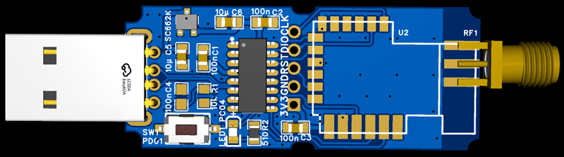

# zigbee firmware and releated

EmberZNet (EZSP) Zigbee 3.0 / Zigbee Coordinator (NCP) firmmware for Silicon Labs mgm210l DIY USB dongle.

## efr32mg210

 Files for usb2zigbee( mgm210l) locate in folder [https://github.com/dongbh/zigbee/](https://github.com/dongbh/zigbee/)


| Configuration Parameter  | Value |Flow Control|
|---------------|-----------|-----------|
| TX  | PC01 ||
| RX  | PC00 ||
| RTS | PC03 ||
| CTS | PC02 ||
| Bootloader | bootloader-uart-xmodem-mgm210l.s37 ||
| Firmware(7.4.3) | ncp-uart-mgm210l-hw-115200-7.4.3-12.5.gbl | Hardware|
| Firmware(7.4.3) | ncp-uart-mgm210l-noflowcontrol-115200-7.4.3-12.5.gbl | None|

## Usage:
1. Install universal-silabs-flasher
```
pip install universal-silabs-flasher
```
2. Download firmware

3. Flashing firmware
```
universal-silabs-flasher --device com5 flash --firmware ncp-uart-mgm210l-hw-115200-7.4.3-12.5.gbl
```
device can be comX (windows) or /dev/ttyUSB0 (linux), replace it and firmware file with your own.
4. Check Status
```
universal-silabs-flasher --device com5 probe
```
