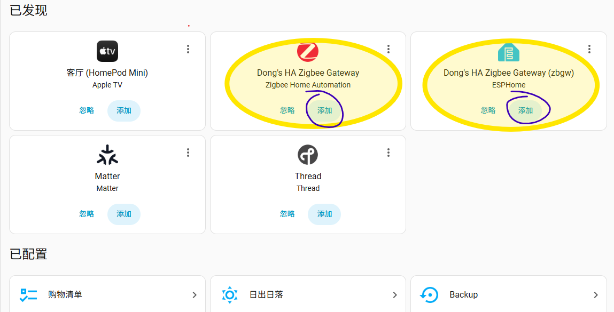

# zbgw 有线 Zigbee + BLE 网关

zbgw 是一款面向 Home Assistant 的有线 Zigbee + BLE 网关。它通过以太网接入局域网，把板载 EFR32 Zigbee 模块作为网络串口服务提供给 Home Assistant ZHA、Zigbee2MQTT 以及 universal-silabs-flasher` 等工具使用；同时也提供 BLE 扫描和 Home Assistant Bluetooth Proxy 能力。

当前固件为原生 ESP-IDF 固件，Zigbee 串口网关、BLE 扫描、Bluetooth Proxy、Web 管理、运行诊断、ESP32 系统升级和 EFR32 Zigbee 固件升级都由网关固件直接提供。

## 主要特点

- 有线网络：ESP32 通过 RTL8201/SR8201 以太网 PHY 接入网络，适合长期固定部署。
- Zigbee 网关：EFR32 Zigbee 模块通过 UART 连接 ESP32，并以 TCP 串口形式暴露到局域网。
- 支持 Home Assistant ZHA：使用 `socket://<网关IP>:6636` 接入。
- 支持 Zigbee2MQTT：使用 `tcp://<网关IP>:6636`，适配器类型通常为 `ember`。
- 支持 BLE / Bluetooth Proxy：Home Assistant 可通过 ESPHome API 兼容服务使用网关的 BLE 能力。
- Web 管理页面：可配置网络、设备名称、Web 密码、Zigbee TCP 端口和 UART 参数。
- 在线升级：支持 ESP32 系统固件升级，也支持 EFR32 Zigbee `.gbl` 固件升级。
- 本地上传升级：ESP32 OTA 文件和 EFR32 GBL 文件都可以通过 Web 页面上传。
- 运行诊断：提供事件日志、BLE 状态、Zigbee TCP 连接状态等指标。
- 外置天线设计：Zigbee 和 ESP32 均使用天线接口，便于根据部署环境优化信号。
- Type-C 供电，体积小，适合放在弱电箱、机柜或家庭中心位置长期运行。

## 默认信息

| 项目 | 默认值 |
| --- | --- |
| 主机名 | `zbgw` |
| mDNS 地址 | `zbgw.local` |
| Web 地址 | `http://zbgw.local/` |
| Web 用户名 | `admin` |
| Web 默认密码 | `zbgw8201` |
| Zigbee TCP 端口 | `6636` |
| ESPHome API 端口 | `6053` |
| Zigbee UART | UART1, `460800`, 8N1, RTS/CTS |
| Zigbee UART 引脚 | TX `GPIO33`, RX `GPIO35`, RTS `GPIO32`, CTS `GPIO34` |
| 以太网 PHY | RTL8201/SR8201 |
| 以太网引脚 | MDC `GPIO23`, MDIO `GPIO18`, PHY reset `GPIO12` |

## 快速使用

1. 接通 Type-C 电源和网线。
2. 等待网关从路由器获取 IP 地址。
3. 在路由器 DHCP 列表中查找 `zbgw`，或尝试访问：

   ```text
   http://zbgw.local/
   ```

4. 使用默认账号登录 Web 页面：

   ```text
   用户名：admin
   密码：zbgw8201
   ```

5. 首次部署后建议修改 Web 密码。
6. 如果 `zbgw.local` 无法解析，请直接使用路由器中看到的 IP，例如：

   ```text
   http://192.168.1.99/
   ```


## 接入 Home Assistant ZHA

1. 开机一段时间后 homeassistant 会自动发现 "Dong's HA Zigbee Gateway Zigbee Home Automation"设备，直接点击即可，也可以手动添加，如下所示：
2. 打开 Home Assistant。
3. 进入“设置” -> “设备与服务” -> “添加集成”。
4. 搜索并选择 `Zigbee Home Automation`。
5. 无线射频类型选择 `EZSP`。
6. 串口设备路径填写：

   ```text
   socket://192.168.1.99:6636
   ```

   将 `192.168.1.99` 替换为你的网关 IP。

7. 端口速度和数据流控制通常保持默认即可。当前固件默认 UART 为 `460800`，并启用硬件流控。
8. 按 Home Assistant 提示创建新 Zigbee 网络，或恢复已有网络。
9. 完成后，在 ZHA 集成中添加 Zigbee 设备。

## 接入 Zigbee2MQTT

在 Zigbee2MQTT 配置中使用 TCP 串口：

```yaml
serial:
  port: tcp://192.168.1.99:6636
  adapter: ember
```

将 IP 地址替换为你的网关地址。较旧版本的 Zigbee2MQTT 可能仍使用 `adapter: ezsp`；如果使用新版本，Silicon Labs EZSP/EmberZNet 适配器通常使用 `ember`。

ZHA 和 Zigbee2MQTT 通常不要同时连接同一个 Zigbee TCP 端口。网关允许新的 TCP 客户端接入，但新的客户端会替换旧连接。

## 使用 BLE / Bluetooth Proxy

固件启动后会同时启动 BLE Tracker 和 ESPHome API 兼容服务，默认监听 `6053` 端口。

在 Home Assistant 的“设备与服务”中，网关可能会以 "Dong's HA Zigbee Gateway (zbgw) ESPHome" 形式被发现(见上图)，直接点击即可添加。配置后，Home Assistant 可以通过网关接收 BLE 广播，并使用受支持的 Bluetooth Proxy 功能。小米温湿度计等 BLE 设备是否能被自动识别，取决于 Home Assistant 中对应设备和集成的支持情况。

网关也提供 BLE 广播 HTTP API，并带有桥接工具，可将 BLE 广播写入 JSONL，或发布到 MQTT/Home Assistant：

## Web 管理和升级

Web 页面用于配置、状态查看和固件升级。配置保存后，建议按页面提示重启网关，使网络和串口参数完整生效。

可管理内容包括：

- 设备名称、Web 密码和当前网络状态。
- 以太网优先、WiFi 回退、静态 IP 等网络配置。
- Zigbee TCP 端口、UART 波特率、缓冲区和硬件流控（不建议更改）。
- EFR32 Zigbee 模块信息探测和复位。
- BLE 扫描状态、最近 BLE 设备和广播摘要。
- 事件日志和运行指标。

## 固件更新

- 系统检测到固件更新后，会直接在 homeassistant里的”通知“里面显示，如有需要，可以直接点击更新，也可以手动更新：

- ESP32 系统固件：支持 URL 在线升级，也支持上传 `zbgw_ota.bin` 或 `zbgw.bin`。
- EFR32 Zigbee 固件：支持 URL/manifest 在线升级，也支持上传 `.gbl` 文件。


升级 EFR32 Zigbee 固件时，网关会暂停 Zigbee TCP 服务，让 EFR32 进入 bootloader，并通过 XMODEM 写入固件。升级期间不要断电。

## 手工升级 EFR32 固件

如果需要绕过 Web 页面，也可以使用 `universal-silabs-flasher` 通过 TCP 串口刷写 EFR32 固件。

假设网关地址为 `192.168.1.99`，固件文件为 `ncp-uart-mg21-460800.gbl`：

```powershell
universal-silabs-flasher --device socket://192.168.1.99:6636 flash --firmware ncp-uart-mg21-460800.gbl
```

刷写前请确认固件文件与板载 EFR32 型号、波特率和流控配置匹配。

## LED 指示

- 左侧指示灯：用于显示系统状态。
- 右侧指示灯：用于显示网络状态，网络就绪后点亮。
- 中间指示灯：用于显示zibee状态，没有 Zigbee TCP 客户端时关闭；有客户端连接时常亮；有 Zigbee 数据活动时闪烁。

## 注意事项

- 首次部署后请修改 Web 默认密码。
- ZHA 和 Zigbee2MQTT 二选一，不可同时访问 Zigbee 模块。
- EFR32 升级过程中不要断电，也不要让其它工具连接 Zigbee TCP 端口。

## TODO
- 适配thread固件。